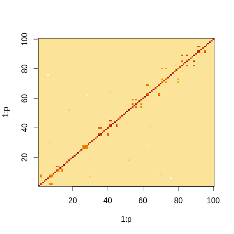

RTsampler
================

<!-- README.md is generated from README.Rmd. Please edit that file -->

# Reverse Telescoping Samplers for Element-wise Graphical Priors

<!-- badges: start -->
<!-- badges: end -->

R package with Rcpp/RcppArmadillo implementation of MCMC samplers based on Reverse
Telescoping Decomposition for Gaussian graphical models under two priors
on the precision matrix:

1.  Graphical Horseshoe (GHS)

2.  Graphical Horseshoe-like (GHSL)

We provide an RT (Reverse–Telescoping) sampler alongside a baseline
Cyclical sampler for comparison, as well as example script to
generate ground-truth precision matrices for simulation studies.

## Installation

This package can be installed directly from github using the R package
`devtools`.

``` r
install.packages("devtools")
library(devtools)
install_github("gao702/RTsampler", dependencies = TRUE)
```

## Description:

We consider the problem of fully Bayesian posterior estimation and
uncertainty quantification in undirected Gaussian graphical models via
Markov chain Monte Carlo (MCMC) under recently-developed element-wise
graphical priors, such as the graphical horseshoe. This package allows
posterior MCMC sampling using a reverse telescoping block decomposition
for Gaussian Graphical Model under element-wise priors on the precision
matrix, which achieves an order of magnitude time complexity reduction
compared to the cyclical sampler in high dimensions.

## Example

This is a basic example script that simulates data from a multivariate normal model and fits the GHS model using RT and cyclical samplers:

``` r
library("RTsampler")

p = 100  # number of variables
n = 90  # sample size
M = 7000  # Total MCMC iterations
burnin = 3000  # Burn-in iterations
prior = "GHS" # prior = c("GHS", "GHSL")
seed = 1

##### generate precision matrix Theta_0 and corresponding covariance Sigma #####
Theta_0 <- generate_truth_PrecisionMat(p,structure = "cliques neg") # structure =  c("tridiagonal", "hubs", "cliques neg", "cliques pos")
Sigma = solve(Theta_0)
image(1:p,1:p,Theta_0)
```


``` r

##### generate simulated Y #####
Mu = rep(0,p)
set.seed(seed)
Y <- MASS::mvrnorm(n=n,mu=Mu,Sigma=Sigma)
S <- t(Y)%*%Y

##### 1. RT sampler (proposed faster method) #####
set.seed(seed)
out_RT <- RT_sampler_cpp(Y,M,burnin,seed,prior)
#> Warning in RT_sampler_cpp(Y, M, burnin, seed, prior): When called from R, the
#> RNG seed has to be set at the R level via set.seed()
est_matrix_RT <- apply(out_RT[[1]],c(1,2),mean)
image(1:p,1:p,est_matrix_RT)
```


``` r

##### 2. Cyclical sampler (baseline method to be compared with) #####
set.seed(seed)
out_Cyclical <- Cyclical_sampler(S,n,M, burnin, prior)
#> iter = 1000
#> iter = 2000
#> iter = 3000
#> iter = 4000
#> iter = 5000
#> iter = 6000
#> iter = 7000
est_matrix_Cyclical <- apply(out_Cyclical[[1]],c(1,2),mean)
image(1:p,1:p,est_matrix_Cyclical)
```



## References:

\[1\] Gao, Z., Sagar, K., Bhadra, A. (2025). An Order of Magnitude Time
Complexity Reduction for Gaussian Graphical Model Posterior Sampling
Using a Reverse Telescoping Block Decomposition.
